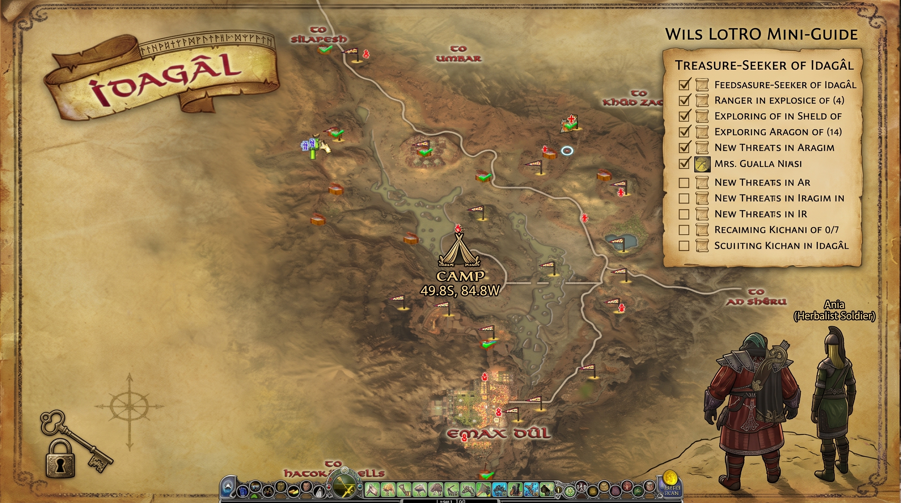
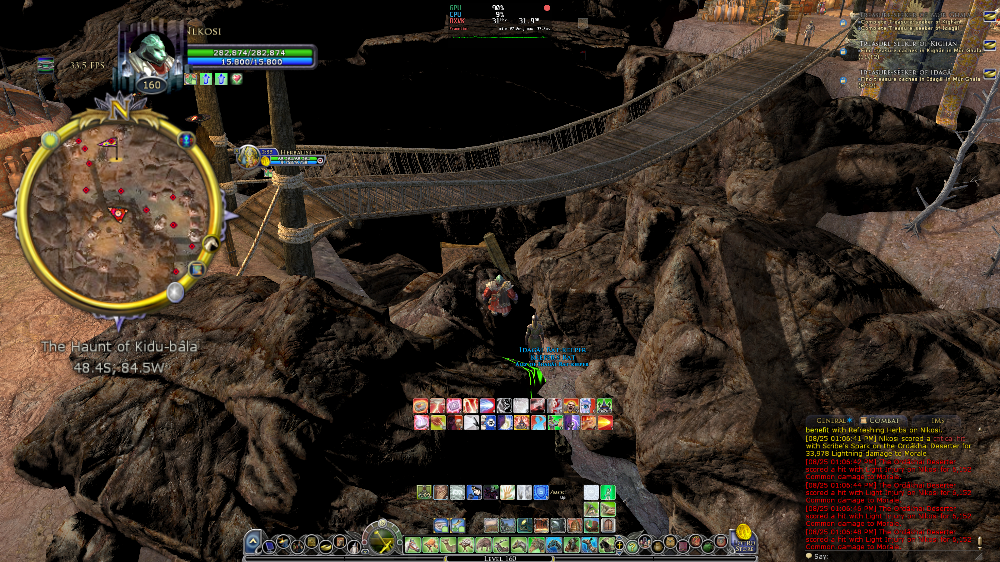
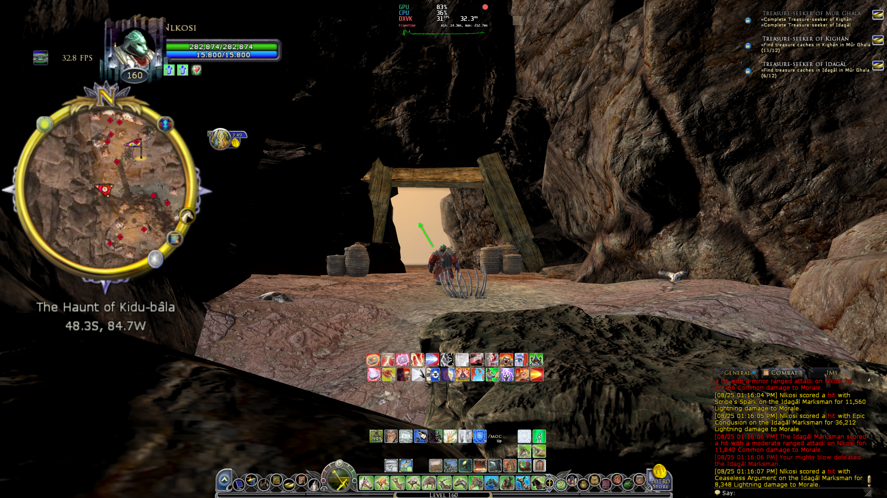
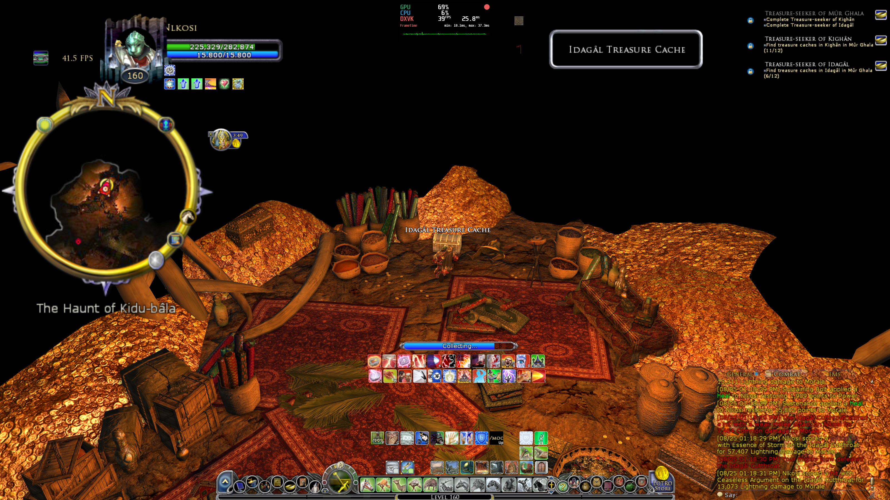

# Wils LotRO Mini-Guide

Her samler vi alle de utspekulerte skattekistene Z-aksen i LotRO prøver å gjemme fra oss.

## 1. The Haunt of Kidu-bâla (Idagál)
**Koordinater:** 48.4S, 84.5W (Radaren lurer deg) -> 48.3S, 84.7W (Faktisk huleinngang)

Dette er den klassiske Z-akse-fellen! Radaren forteller deg at kisten er rett foran deg når du står på hengebrua, men den er i realiteten langt nede i mørket i bunnen av juvet. Du kan spamme *Delete* til tastaturet kneler uten å få tak i den herfra.

**Slik finner du den:**
1. Ikke hopp fra brua! Finn en trygg vei ned i selve dalbunnen.
2. Ri i bunnen av kløfta, rett inn under hengebrua, og se etter inngangen til fangehullet *The Haunt of Kidu-bâla*.
3. Naviger deg gjennom hulesystemet helt til du finner en massiv haug med gullmynter og røde tepper. Skattekisten troner på toppen av gullet!

### Bildebevis:
**Feil sted (oppe på brua):**

**Riktig sted (huleinngangen i bunnen av juvet):**

**Skatten er funnet:**

